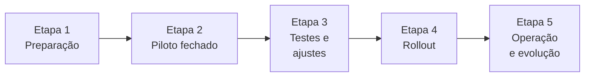
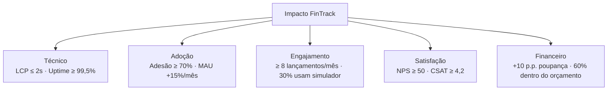

# FinTrack — Plano de Implantação e Métricas de Impacto

> Documento de implantação da solução **FinTrack** — aplicação web para controle de gastos pessoais e gerenciamento de investimentos (SPA em HTML/CSS/JS, Chart.js via CDN, persistência em `localStorage`).

---

## Sumário Executivo

O FinTrack é uma aplicação web leve, distribuída como arquivos estáticos, voltada a usuários que desejam centralizar o controle do orçamento mensal, visualizar indicadores financeiros e simular o crescimento de investimentos por juros compostos. Por não depender de backend nem de build tools, sua implantação inicial é de baixo custo, baixo risco e altamente escalável via CDN/hospedagem estática (GitHub Pages, Netlify, Vercel, S3 + CloudFront).

Este documento descreve **(1)** as etapas de implantação — do piloto ao rollout — com cronograma de curto, médio e longo prazo, recursos e plano de comunicação/treinamento; e **(2)** os KPIs definidos para mensurar o impacto da solução, com metas e forma de mensuração.

---

## 1. Plano de Implantação

### 1.1. Visão geral das etapas

#### Etapa 1 — Preparação (Setup técnico e organizacional)
- Provisionamento da hospedagem estática (GitHub Pages / Netlify / Vercel) e do domínio.
- Configuração de HTTPS, cabeçalhos de segurança básicos (`Content-Security-Policy`, `X-Frame-Options`) e cache da CDN.
- Definição do repositório Git, branch de produção (`main`) e branch de homologação (`develop`).
- Criação de checklist de QA manual (login, CRUD de gastos/rendas, gráficos, simulador).
- Definição da matriz de browsers/dispositivos suportados (Chrome, Edge, Firefox, Safari; desktop + mobile).

#### Etapa 2 — Projeto Piloto
- Liberação para um grupo restrito (10 a 20 usuários) — ex.: colaboradores internos ou turma de teste.
- Coleta de feedback estruturada via formulário (Google Forms) ao final de cada semana.
- Monitoramento de erros via console e relatos qualitativos.
- Validação dos quatro fluxos críticos:
  - Login / logout;
  - Cadastro, edição e exclusão de gastos e rendas;
  - Consistência do Dashboard e do Resumo Mensal;
  - Cálculos do Simulador de Investimentos.

#### Etapa 3 — Testes e ajustes
- Correção de bugs reportados e refinamento de UX (rótulos, mensagens de erro, responsividade).
- Testes de aceitação com usuários-chave (UAT).
- Teste de carga leve (a aplicação é estática, foco em latência da CDN e tempo de renderização inicial).
- Auditoria de acessibilidade (contraste, navegação por teclado, leitores de tela).
- Revisão de segurança: limites do `localStorage`, sanitização de entradas, ausência de dados sensíveis em logs.

#### Etapa 4 — Rollout
- Publicação em produção via pipeline CI/CD (push em `main` → deploy automático).
- Comunicação oficial de lançamento (e-mail, intranet, redes sociais internas).
- Disponibilização de canal de suporte (e-mail/chat).
- Onboarding guiado: tela de boas-vindas, tooltips e vídeo curto demonstrativo.

#### Etapa 5 — Operação e evolução
- Coleta contínua de métricas (ver Seção 2).
- Ciclos quinzenais de melhorias e correções.
- Roadmap de evolução: backend opcional para sincronização entre dispositivos, exportação CSV/PDF, autenticação real (OAuth), integração com Open Finance, app mobile (PWA).

---

### 1.2. Cronograma sugerido

#### Curto prazo (0 a 3 meses) — Implantação inicial

| Semana | Atividade | Responsável |
|--------|-----------|-------------|
| 1 | Provisionamento da hospedagem, domínio e HTTPS | Time técnico |
| 2 | Configuração de CI/CD e ambiente de homologação | Time técnico |
| 3 | Checklist de QA e auditoria de acessibilidade | QA |
| 4 – 5 | Projeto piloto com 10–20 usuários | Time de produto |
| 6 – 7 | Coleta de feedback e correções | Dev + QA |
| 8 | UAT com usuários-chave | Produto |
| 9 – 10 | Ajustes finais, plano de comunicação | Marketing + Produto |
| 11 – 12 | Rollout oficial e onboarding | Todos |

#### Médio prazo (3 a 6 meses) — Estabilização e adoção

- Monitoramento contínuo dos KPIs (Seção 2).
- Ciclos quinzenais de melhorias incrementais (UX, novas categorias, filtros).
- Programa de treinamento ampliado (webinars mensais).
- Introdução de **PWA** (instalação no celular, funcionamento offline).
- Exportação de dados em CSV/JSON.

#### Longo prazo (6 a 18 meses) — Evolução estratégica

- Backend opcional (Node.js + banco gerenciado) para sincronização multi-dispositivo.
- Autenticação real com OAuth (Google/Apple) e recuperação de senha.
- Integração com Open Finance / extratos bancários.
- Módulo de metas financeiras e alertas personalizados.
- Internacionalização (i18n) e suporte a múltiplas moedas.
- App mobile dedicado (React Native ou continuação como PWA evoluída).

---

### 1.3. Recursos necessários

#### Recursos humanos

| Papel | Dedicação | Fase principal |
|-------|-----------|----------------|
| Gerente de Projeto | Parcial (20%) | Todas |
| Desenvolvedor Front-end | Tempo integral | Preparação, testes, evolução |
| Designer UX/UI | Parcial (30%) | Preparação e melhorias |
| QA / Testes | Parcial (40%) | Testes, piloto, rollout |
| Especialista em Segurança | Pontual | Auditoria pré-rollout |
| Suporte ao Usuário | Parcial (20%) | A partir do piloto |
| Marketing / Comunicação | Pontual | Rollout |

#### Recursos técnicos

- Repositório Git (GitHub/GitLab) — gratuito.
- Hospedagem estática + CDN (GitHub Pages, Netlify ou Vercel) — plano gratuito atende ao MVP.
- Domínio personalizado (~R$ 40/ano).
- Ferramenta de monitoramento web (Google Analytics 4, Plausible ou Umami) — gratuita ou baixo custo.
- Ferramenta de coleta de feedback (Google Forms, Typeform) — gratuita.
- Ferramenta de gestão de tarefas (Trello, Jira, GitHub Projects) — gratuita.

#### Recursos financeiros (estimativa para os 3 primeiros meses)

| Item | Custo estimado (R$) |
|------|---------------------|
| Hospedagem + CDN | 0 – 150 / mês |
| Domínio | 40 / ano |
| Ferramentas de monitoramento e feedback | 0 – 100 / mês |
| Eventual mão de obra externa (design, segurança) | 2.000 – 5.000 (pontual) |
| **Total estimado curto prazo** | **R$ 2.500 – 6.000** |

> Observação: por ser uma aplicação 100% estática no MVP, o custo de infraestrutura é marginal. O maior investimento é em pessoas (desenvolvimento e suporte).

---

### 1.4. Plano de comunicação e treinamento

#### Comunicação

| Fase | Canal | Mensagem-chave |
|------|-------|----------------|
| Pré-lançamento | E-mail / intranet | Apresentação do FinTrack e convite ao piloto |
| Piloto | Reuniões quinzenais + formulário | Coleta de feedback estruturado |
| Pré-rollout | Newsletter + redes sociais internas | Data oficial de lançamento + benefícios |
| Rollout | Banner no portal + vídeo de 2 min | Como começar em 3 passos |
| Pós-rollout | E-mail mensal | Dicas, novidades e métricas de uso |

#### Treinamento

- **Material escrito**: guia de uso (PDF + página HTML) com prints e passo a passo.
- **Vídeo demonstrativo**: 2 a 3 minutos cobrindo login, cadastro de gastos/rendas e simulador.
- **Tooltips in-app**: dicas contextuais nas primeiras visitas a cada view.
- **Webinars mensais**: sessões de 30 min com perguntas e respostas (a partir do médio prazo).
- **FAQ on-line**: lista das dúvidas mais comuns, atualizada continuamente.
- **Canal de suporte**: e-mail dedicado + (opcional) chat assíncrono.

---

## 2. Métricas para Avaliar o Impacto da Solução (KPIs)

Os indicadores abaixo foram escolhidos para cobrir as quatro dimensões críticas do FinTrack: **desempenho técnico**, **adoção**, **engajamento/qualidade do uso** e **impacto financeiro percebido pelo usuário**.

### 2.1. Tabela de KPIs

| # | KPI | Categoria | Meta | Forma de mensuração | Periodicidade |
|---|-----|-----------|------|----------------------|---------------|
| 1 | Tempo médio de carregamento inicial (LCP) | Desempenho técnico | ≤ 2,0 s em conexão 4G | Google Lighthouse / Web Vitals (`PerformanceObserver`) | Semanal |
| 2 | Tempo médio de resposta de ações da interface | Desempenho técnico | ≤ 200 ms para CRUD e troca de abas | Instrumentação `performance.now()` nos handlers de `events.js` | Semanal |
| 3 | Disponibilidade do serviço (uptime) | Desempenho técnico | ≥ 99,5% mensal | Monitor externo (UptimeRobot / StatusCake) | Mensal |
| 4 | Taxa de adesão (usuários ativos / convidados) | Adoção | ≥ 70% no piloto / ≥ 50% no rollout | Analytics (Plausible/GA4) — usuários únicos | Mensal |
| 5 | Usuários ativos mensais (MAU) | Adoção | Crescimento ≥ 15% ao mês nos 6 primeiros meses | Analytics — sessões únicas por usuário | Mensal |
| 6 | Retenção em 30 dias | Engajamento | ≥ 40% dos novos usuários | Cohort analysis no Analytics | Mensal |
| 7 | Frequência média de lançamentos por usuário | Engajamento | ≥ 8 lançamentos/mês por usuário ativo | Evento custom disparado em `expense-form` e `income-form` | Mensal |
| 8 | Uso do Simulador de Investimentos | Engajamento | ≥ 30% dos usuários ativos usam ao menos 1x/mês | Evento custom no submit do simulador | Mensal |
| 9 | Taxa de erros de JavaScript | Qualidade | ≤ 1% das sessões | `window.onerror` + serviço de log (Sentry free tier) | Semanal |
| 10 | Taxa de abandono na tela de login | UX | ≤ 10% | Funil no Analytics (login-view → app-view) | Mensal |
| 11 | NPS (Net Promoter Score) | Satisfação | ≥ 50 (zona de qualidade) | Pesquisa in-app trimestral (1 pergunta + 1 aberta) | Trimestral |
| 12 | CSAT do suporte | Satisfação | ≥ 4,2 / 5,0 | Pesquisa pós-atendimento | Mensal |
| 13 | Redução de custos operacionais com planilhas/ferramentas substituídas | Impacto financeiro (organização) | Redução de 20% em licenças/horas dedicadas | Comparativo antes × depois do rollout | Trimestral |
| 14 | Aumento da taxa de poupança dos usuários | Impacto financeiro (usuário) | +10 pontos percentuais em 6 meses | KPI "Taxa de Poupança" já calculado em `views/monthly.js` — agregação anônima opt-in | Trimestral |
| 15 | Percentual de usuários que atingem a meta de orçamento (comprometimento da renda < 80%) | Impacto financeiro (usuário) | ≥ 60% dos usuários ativos | Barra de comprometimento já existente — agregação anônima opt-in | Mensal |

### 2.2. Justificativa dos KPIs frente ao escopo do projeto

- **KPIs 1–3 (desempenho técnico)**: garantem que a promessa de uma SPA leve seja mantida; alinhados à arquitetura estática + CDN.
- **KPIs 4–6 (adoção e retenção)**: medem se a solução de fato substitui as planilhas e apps anteriores no dia a dia.
- **KPIs 7–8 (engajamento)**: validam o uso real das duas funcionalidades-núcleo (CRUD financeiro e simulador), evitando "usuários fantasmas".
- **KPIs 9–10 (qualidade e UX)**: detectam regressões e fricções de uso após cada deploy.
- **KPIs 11–12 (satisfação)**: traduzem a percepção do usuário em número comparável ao longo do tempo.
- **KPIs 13–15 (impacto financeiro)**: ligam a ferramenta ao seu propósito final — **melhorar a vida financeira do usuário** — usando dados que a própria aplicação já calcula (Saldo do Mês, Taxa de Poupança, comprometimento de renda).

### 2.3. Forma de mensuração — detalhamento

- **Instrumentação no código**: criar um módulo `src/analytics.js` para encapsular o envio de eventos (não invasivo, baseado em `navigator.sendBeacon`), respeitando consentimento LGPD.
- **Eventos custom mínimos**: `login_success`, `login_fail`, `expense_added`, `income_added`, `simulator_run`, `tab_switch`, `error_js`.
- **Privacidade**: todos os agregados financeiros (KPIs 14 e 15) só são enviados se o usuário aceitar explicitamente; nenhum dado pessoal identificável é coletado.
- **Painel de acompanhamento**: dashboard interno (Looker Studio / Metabase) consumindo os dados do Analytics, atualizado em tempo real.
- **Revisão periódica**: reunião mensal de métricas com produto, dev e suporte para revisar resultados e priorizar o backlog.

### 2.4. Visão consolidada — Dimensões × Metas

---

## 3. Considerações Finais

O FinTrack reúne baixa complexidade de implantação, custo inicial reduzido e um conjunto claro de indicadores que conectam a operação do produto ao seu propósito: ajudar pessoas a entenderem e melhorarem sua vida financeira. O plano apresentado prioriza um piloto enxuto antes do rollout, garante recursos proporcionais a cada fase e estabelece KPIs aderentes ao escopo atual da aplicação — todos mensuráveis com instrumentação leve e ferramentas gratuitas ou de baixo custo.

A evolução de médio e longo prazo (PWA, backend, Open Finance) é apresentada como um caminho incremental, garantindo que a solução nasça simples e cresça conforme a demanda real e o retorno dos KPIs definidos.
